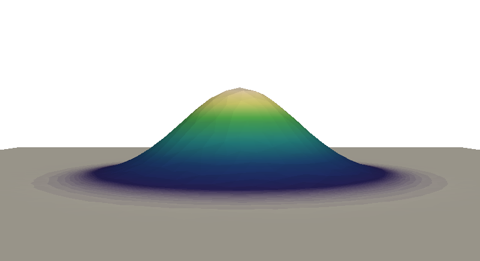

# evolve_glacier

This repository contains a development version of a FEM (Finite Element Method) model for the evolution of the free-surface of land-terminating ice bodies (e.g. glaciers) due to ice flow and mass balance rate, fully accounting for the constraint of **S >= B**. (**S** free surface elevation and **B** bed elevation)

The model consists of different modules that automatize ice flow, computation of the free-surface evolution and generation of updated computational meshes. 
Ice flow computations are based on the full-Stokes equations and performed with the FEM ice flow model [icetools](https://github.com/alexjarosch/icetools).
The simulation framework uses [FEniCS](https://fenicsproject.org/) and [PETSc](https://www.mcs.anl.gov/petsc/) for solving the relevant PDEs and [Gmsh](http://gmsh.info/) to generate 2D and 3D finite element meshes.

A manuscript describing the underlying physics, numerical details and glaciological relevance has been submitted to GMD (Geoscientific Model Development). The title of the manuscript is: 'Free–Surface Flow as a Variational Inequality (evolve_glacier v1.1):
Numerical Aspects of a Glaciological Application'.

In this repository, you can find the source code of the simulation framework.
Besides the standard setup (Streamline-Upwind Petrov Galerkin stabilisation and Crank-Nicholson time discretization), implementations of various different spatial stabilisation approaches as well as time discretization schemes are provided (full description in the manuscript). 
The folders Glacier and Hilltest contain the required input data to reproduce the glacier and hill test examples presented in the manuscript.


## Requirements

We suggest to use the pre-built singularity container [fenics_v2.simg](https://github.com/awirbel/evolve_glacier/releases) that contains an installation of FEniCS v2016.2 and gmsh (vertex coordinates fixed to three decimals). Other versions of FEniCS are currently not supported. 

Requirements to run this singularity container:

* [singularity v2.6](https://www.sylabs.io/guides/2.6/user-guide/installation.html)

Requirements to start individual simulations:

* [gdal](https://gdal.org/) 
* geometry input files (see folder geometry_files)


## How to perform a simulation

* Download the pre-built singularity container ([fenics_v2.simg](https://github.com/awirbel/evolve_glacier/releases))

* Chose standard setup files or a more appropriate spatial stabilisation approach and time discretization scheme for your problem at hand and save those files in your current working directory

* Create a subfolder called data

* Save the required input files in the data folder, these are for (i) STL version: initial 3D mesh (glacier_0000.xml), initial 2D mesh (surface_2D.xml), box surface STL file (surface_shell_domain.stl), vol_mesh_domain.geo 
OR (ii) msh versoin: initial 3D mesh (glacier_0000.xml), initial 2D mesh (surface_2D.xml), box msh file (volmesh_initblock.msh). See folder geometry_files for infos.

* Set the path to your working directory in cfg_datadir.py and run_test01.sh

* Set free-surface evolution time step in cfg.py (line 57: dt_ADV) in seconds as well as corner coordinates of the computational domain (line 58-62: nx1 (east), nx2 (west), ny1 (south), ny2 (north). There are more options, directly check cfg.py and cfg_datadir.py.

To run the model, execute the following line in a shell from your current working directory:
```shell
singularity exec pathtocontainer/fenics_v2.simg ./run_test01.sh > log01.txt
```

### Hill test example 

In order to run the hill test in Section 7 in the manuscript using the Standard Setup, follow these steps: 

* Save all the files from Hilltest/Standard_Setup to your working directory (this already contains a folder with the required input data)

* Set the correct path to your working directory in cfg_datadir.py and run_test01.sh 

* simply run:
    ```shell
    singularity exec pathtocontainer/fenics_v2.simg ./run_test01.sh > log01.txt
    ```
    
This will reproduce the hill test results, open paraview and load the Solution_%s_%04d_new.pvd files to visualize how the free surface evolves!


