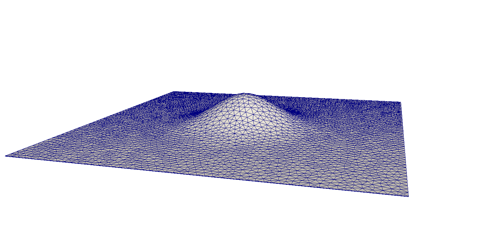

# How to create initial geometry files

To start the free-surface evolution computations, geometry input files are required for your glaciological application. 
Following these steps, you can generate a 3D finite element mesh from your DEM input data. 
First, you have to save your DEM information as two individual tif files that represent the surface and bed elevation of your glacier case and save these datasets as: surf.tif and bed.tif.
(Note that using this approach, the spatial resolution of the tif files should be significantly higher than the spatial resolution of the desired 3D finite element mesh, consider interpolation to increase the spatial resolution for the tif generation)
These tifs have to cover a rectangular domain that includes all ice bodies of interest and the relevant surroundings.

Follow these steps to create an initial 3D geometry mesh for your glacier example (this workflow corresponds to the box STL file option in the manuscript):

* identify a rectangular domain covering the glacier as well as relevant surroundings (determine corner coordinates) - these have to be <= the domain of the tif file
* save surface_2D.geo, surface_shell_domain.geo, glacier_0000.geo (from this folder) to your current working directory
* enter the correct corner coordinates into surface_shell_domain.geo and surface_2D.geo and set desired spatial resolution (cl1=desired resolution)
* run in a shell (do not use the singularity container yet, it is called separately for the required steps as it doesn't include a gdal installation - however you need to have a gdal installation for this step on your machine)
    ```
    bash makemesh.sh
    ```
    
By executing makemesh.sh, you generate the following files: 

* surface_2D.xml
* surface_shell_domain.stl
* glacier_0000.xml

copy these files and vol_mesh_domain.geo (from this folder) to your subfolder called data in order to start simulations of your glacier case.

## Example gaussian-shaped hill on a flat plane

In this example, an initial 3D mesh is generated for a gaussian-shaped hill on a flat plane. The corresponding surface and bed elevation tifs are provided as surf.tif and bed.tif in the assets of the release v1.1 (geometry_inputfiles). 

To create the 3D mesh just download the surf.tif and bed.tif files from the assets of release v1.1 and copy all the files of this folder to your current working directory and set the correct path to the singularity container in makemesh.sh.

Then simply run:

 ```
 bash makemesh.sh
 ```
 
 Now you have created a 3D mesh of the gaussian-shaped hill on flat plane with roughly 20 m spatial resolution!
 



